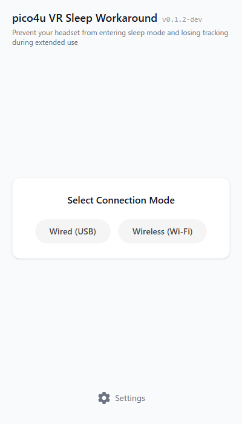

<h1>
  
  pico4u-vr-sleep-workaround
</h1>

pico4u-vr-sleep-workaroundは、開発時や特定の用途において、Pico 4 Ultra VRヘッドセットが自動的にスリープ状態になるのを防ぐための回避ツールです。定期的にADB経由でキープアライブ（Wake Up）信号を送信することで動作します。

[English Version](../README.md)

## 🌟 主な機能

- **キープアライブ信号の送信**: 3秒ごとに`keyevent 224`（ウェイクアップ操作）を送信し、ヘッドセットがスリープモードに入るのを防ぎます。
- **接続モード**: 有線（USB）および無線（TCP/IP）でのADB接続の両方をサポートしています。
- **デバイス検証**: 接続されたデバイスを自動検出し、Pico 4 Ultraであること（モデル名に`A9210`が含まれていること）を確認します。
- **自動画面暗転**: 設定した時間（時間単位）が経過した後に、画面の焼き付きを防ぎバッテリーを節約するため、ヘッドセットの画面の明るさを最小（`1`）に自動で下げることができます。

## 📸 スクリーンショット

## 🔧 事前準備：USBデバッグの有効化

本ツールをご利用いただく前に、ご使用のPico 4 Ultraにて以下の設定を行ってください。
1. Pico 4 Ultra内で「設定」＞「一般」＞「概要」を開きます。
2. 「ソフトウェアバージョン」を7回連続でクリックし、開発者モードを有効にします。
3. 「設定」＞「開発者」を開き、「USBデバッグ」をオンに切り替えます。

## 🚀 セットアップと使い方

1. お使いのプラットフォーム向けの最新リリースをダウンロードしてください（Windows用の `nsis` / `msi` インストーラーが提供されています）。
2. アプリケーションをインストールし、起動します。
3. Pico 4 UltraをUSBまたはWi-FiでPCに接続します（ヘッドセット内にUSBデバッグの許可プロンプトが出た場合は「許可」を選択してください）。
4. 接続モードを選択し、**Start Keep Alive（キープアライブ開始）**をクリックしてください。

## 👨‍💻 For Developers / 開発者向け

開発環境のセットアップ、ソースからのビルド方法、およびプロジェクトへの貢献に関する詳細は、[CONTRIBUTING.md](../CONTRIBUTING.md) を参照してください。
