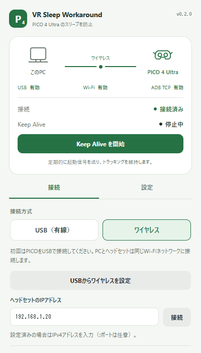
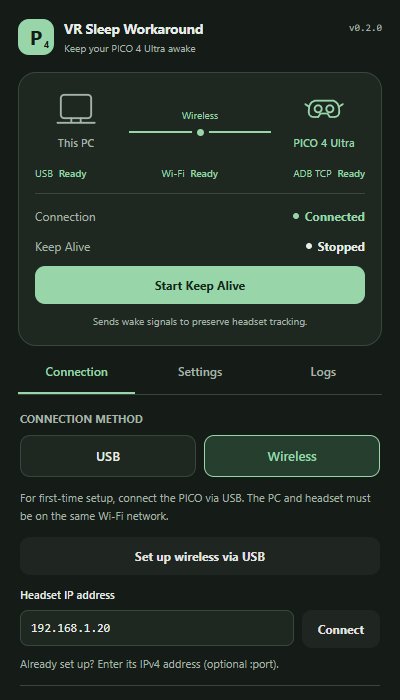

# UI refresh verification

The application version remains **0.2.0**. These changes are split into dependency, refactor, and dashboard PRs. Review and merge them in that order; each PR targets the previous branch so its diff contains only its own changes.

## Local run

```powershell
.\scripts\pnpm.ps1 install --frozen-lockfile
.\scripts\pnpm.ps1 dev
```

Windows installers are generated by `.\scripts\pnpm.ps1 build --no-sign` in `target/release/bundle/nsis/` and `target/release/bundle/msi/`. The repository-local pnpm wrapper avoids broken npm/mise shims. Tauri's build/dev hooks use the same binary.

## Automated verification

- TypeScript check, Oxlint and Oxfmt.
- Vitest: 8 tests for serial saves, failed-save recovery, retry limits, timeouts, aborted retries, polling disposal, polling recovery and transport-specific connection display.
- Rust: 5 tests for device-list parsing, exact target matching, address validation, legacy settings and timer limits; `cargo fmt --check`, `cargo test --locked --offline`, and Clippy with warnings denied.
- Windows Tauri NSIS/MSI build; MSI extraction confirmed ADB, both required DLLs and license files. The extracted ADB executable ran successfully with its bundled DLLs.
- Headless Edge at 400 × 700 with mocked Tauri responses: double-start prevention, mode locking while running, stopping after a status-query error, clearing stale connection success, keyboard tabs, Japanese/English, light/dark, combined settings saves, logs, disconnect/reconnect, USB removal after wireless setup, and manual IP entry. Screenshots below use those mocked responses.

## Headset checks for the reviewer

These need a physical PICO 4 Ultra and have **not** been verified against hardware during this change.

- [ ] Connect via USB and accept the USB debugging prompt. Confirm that unauthorized, offline and other headset models do not enable Start.
- [ ] Set up wireless over USB on the same network. Remove USB and confirm wireless remains connected; test a saved/manual IP and app restart auto-connect.
- [ ] Disconnect and reconnect while stopped and while running. The connection status must change independently of Keep Alive; Stop must remain available on disconnection.
- [ ] Start and stop several times. Confirm wake signals preserve tracking and no additional signals are sent after Stop completes.
- [ ] Set a dim delay, start, and confirm brightness is reduced at that delay. Stop before the delay and confirm the pending dim is cancelled. Brightness is not restored automatically.
- [ ] Change interval and dim delay together, save, restart the app, and verify persistence. Changes apply on the next Start.
- [ ] Change language and appearance, including the system theme. Navigate tabs with arrow keys/Home/End and controls with Tab; verify reduced-motion mode.
- [ ] Confirm an ADB server already running before this app stays alive when the app exits. A server started by this app should exit with it.

## Dashboard screenshots

| Japanese / light | English / dark |
| --- | --- |
|  |  |
